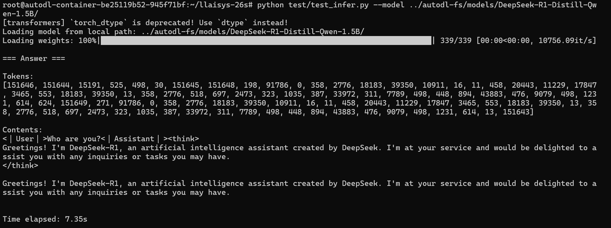
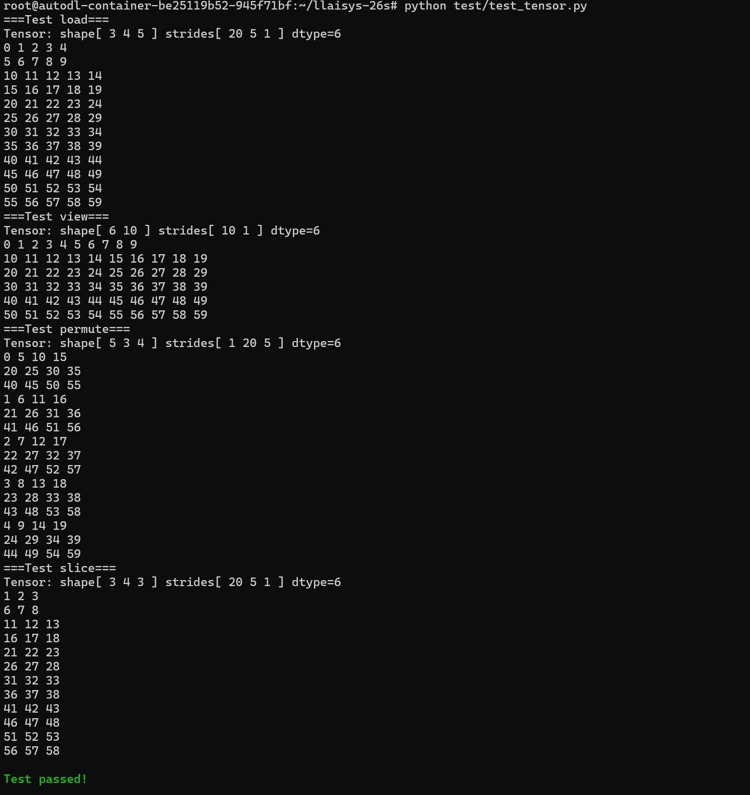
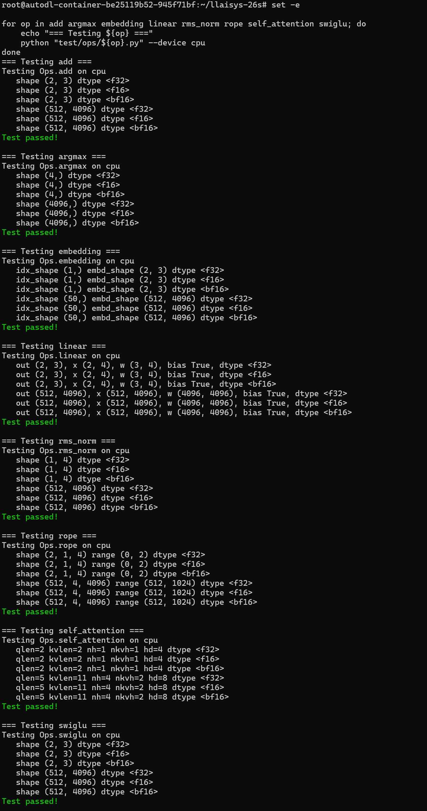
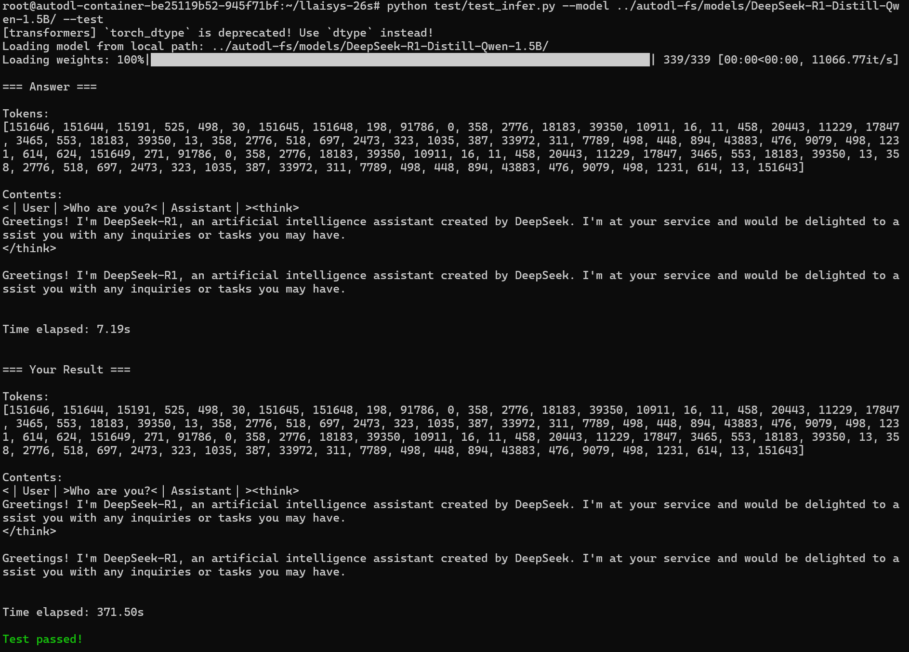
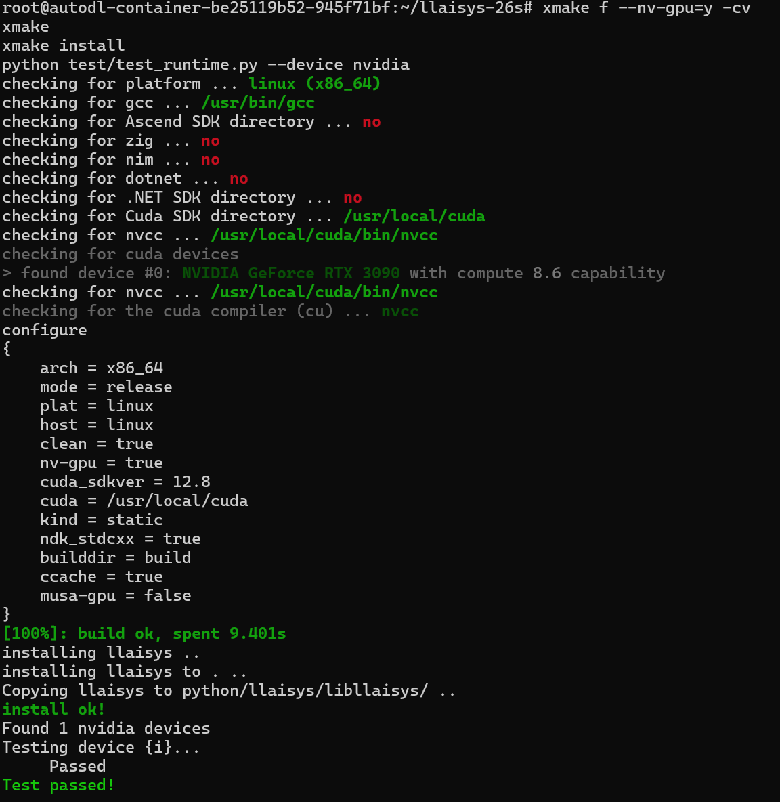
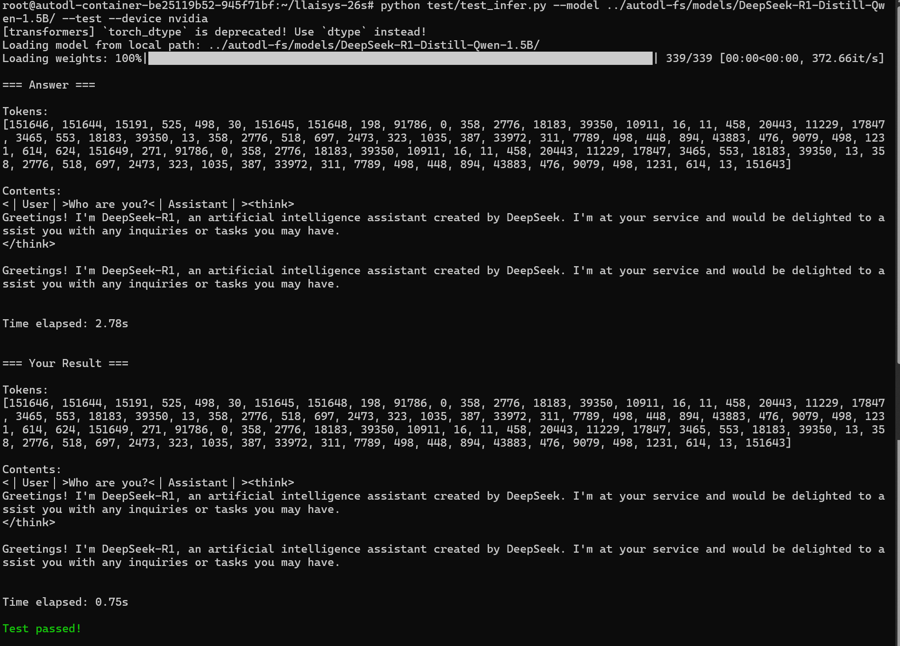
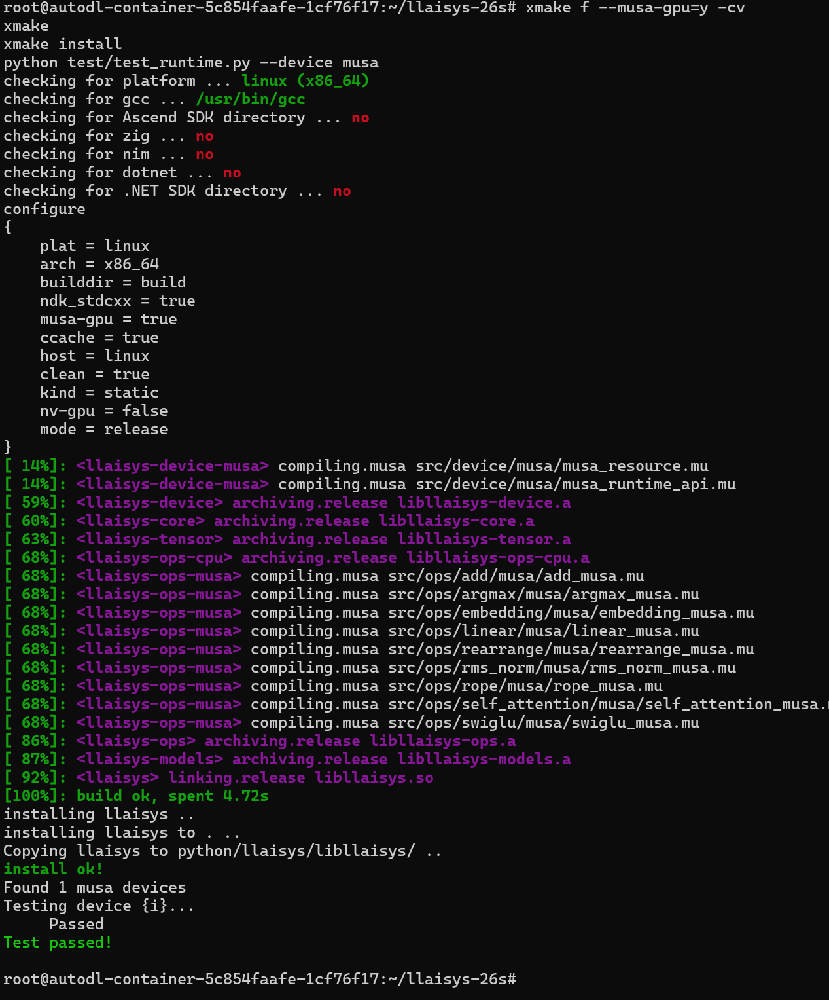
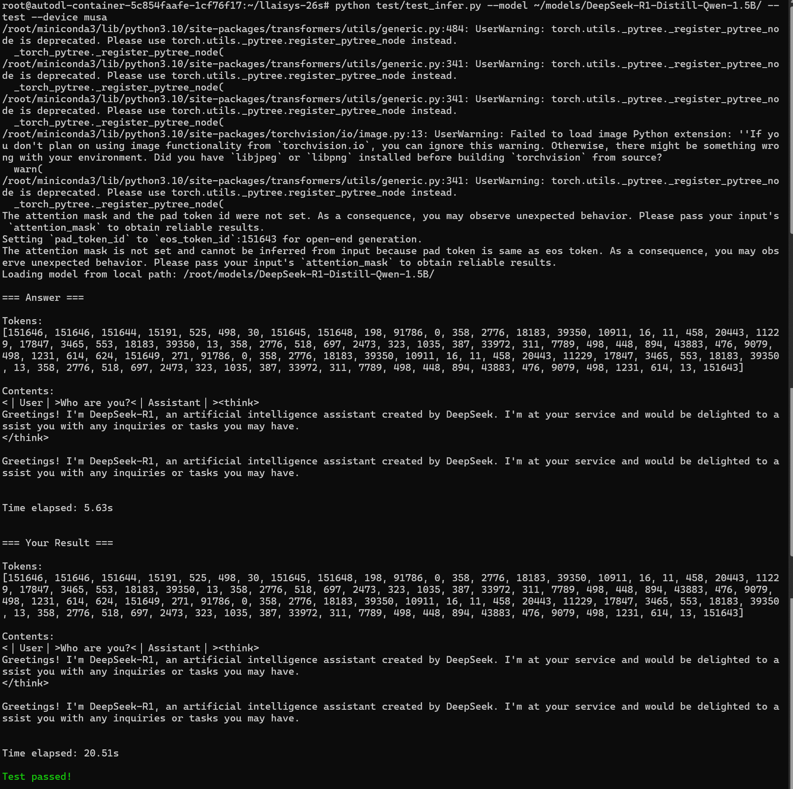

# LLAISYS 作业报告

## 完成情况

本次作业完成了 任务 0–4，主要内容如下：

- 任务 0：完成项目构建、Python 包安装以及基础 Runtime 测试。
- 任务 1：实现 Tensor 的数据加载、连续性判断、`view`、`permute` 和 `slice`。
- 任务 2：实现 CPU 版本的 `argmax`、`embedding`、`linear`、`rms_norm`、`rope`、`self_attention` 和 `swiglu`，支持 Float32、Float16 和 BFloat16。
- 任务 3：在 C++ 后端实现 Qwen2 模型的权重加载、前向计算、KV Cache 和逐 token 贪心解码，并通过 C API 和 ctypes 提供 Python 接口。
- 任务 4：为 NVIDIA CUDA 和摩尔线程 MUSA 两个平台实现 Runtime API、算子和模型推理支持。

## 支持平台

| 平台 | 测试设备 | Runtime | Tensor/Operators | Qwen2 推理 |
| --- | --- | --- | --- | --- |
| CPU | GitHub Actions Ubuntu / Windows | 通过 | 通过 | 通过 |
| NVIDIA CUDA | GeForce RTX 3090，CUDA Toolkit 12.8（Driver 13.0） | 通过 | 通过 | 通过 |
| Moore Threads MUSA | MTT S4000，MUSA SDK 3.1.0 | 通过 | 通过 | 通过 |

NVIDIA 代码位于各模块的 `nvidia/` 目录，使用 `.cu` 文件编译；MUSA 代码位于对应的 `musa/` 目录，使用 `.mu` 文件和 `mcc` 编译。两个后端均通过统一的 Device、Runtime 和 Operator 接口由上层模型调用。

## 实现说明

### Tensor 与算子

Tensor 的视图操作共享底层 Storage，通过 shape、stride 和 offset 表示不同的数据布局。CPU、NVIDIA 和 MUSA 算子由公共入口根据 Tensor 所在设备进行分派。

任务 2 要求的算子均实现 Float32、Float16 和 BFloat16。GPU 版本使用自定义 kernel 完成逐元素、索引、规约、RoPE、Attention 等计算，矩阵乘法在适用情况下调用平台 BLAS，并保留自定义 kernel 路径。

### Qwen2 推理

Python 层负责读取 safetensors 权重并通过 ctypes 调用 C API，模型的前向计算和解码过程均在 C++ 后端完成。推理过程区分 prefill 和 decode，并使用 KV Cache 保存历史 Key/Value，避免每生成一个 token 都重新计算完整上下文。测试采用 argmax 采样，LLAISYS 生成的 token 序列与 PyTorch 参考结果一致。

### CUDA 与 MUSA

构建时分别使用 `--nv-gpu=y` 和 `--musa-gpu=y` 启用对应后端；未启用时不会编译相关设备代码。Runtime API 实现了设备选择、同步、Stream、设备内存和页锁定主机内存管理，以及 Host/Device 之间的数据复制。

在 MTT S4000 上，部分形状和数据类型不能直接使用当前环境中的 muBLAS 路径，因此 Linear 根据数据类型和矩阵规模选择 muBLAS 或自定义分块矩阵乘法 kernel。

## 复现步骤

### CPU

```bash
xmake f -m release
xmake
xmake install -o .
pip install --no-deps -e ./python

python test/test_runtime.py --device cpu
python test/test_tensor.py
python test/ops/add.py --device cpu
python test/ops/argmax.py --device cpu
python test/ops/embedding.py --device cpu
python test/ops/linear.py --device cpu
python test/ops/rms_norm.py --device cpu
python test/ops/rope.py --device cpu
python test/ops/self_attention.py --device cpu
python test/ops/swiglu.py --device cpu
python test/test_infer.py --model /path/to/DeepSeek-R1-Distill-Qwen-1.5B --test --device cpu
```

### NVIDIA CUDA

```bash
xmake f --nv-gpu=y -m release
xmake
xmake install -o .
pip install --no-deps -e ./python

python test/test_runtime.py --device nvidia
python test/ops/add.py --device nvidia
python test/ops/argmax.py --device nvidia
python test/ops/embedding.py --device nvidia
python test/ops/linear.py --device nvidia
python test/ops/rms_norm.py --device nvidia
python test/ops/rope.py --device nvidia
python test/ops/self_attention.py --device nvidia
python test/ops/swiglu.py --device nvidia
python test/test_infer.py --model /path/to/DeepSeek-R1-Distill-Qwen-1.5B --test --device nvidia
```

### Moore Threads MUSA

```bash
XMAKE_ROOT=y xmake f --musa-gpu=y -m release
XMAKE_ROOT=y xmake
XMAKE_ROOT=y xmake install -o .
pip install --no-deps -e ./python

python test/test_runtime.py --device musa
python test/ops/add.py --device musa
python test/ops/argmax.py --device musa
python test/ops/embedding.py --device musa
python test/ops/linear.py --device musa
python test/ops/rms_norm.py --device musa
python test/ops/rope.py --device musa
python test/ops/self_attention.py --device musa
python test/ops/swiglu.py --device musa
python test/test_infer.py --model /path/to/DeepSeek-R1-Distill-Qwen-1.5B --test --device musa
```

## 测试结果

任务 0–3 的 GitHub Actions 已在 Ubuntu 和 Windows 环境通过。RTX 3090 和 MTT S4000 上分别完成了 Runtime、算子和完整模型推理测试，两个 GPU 后端生成的 token 序列均与 PyTorch 参考实现一致。

### 任务 0：环境与参考模型

<details>
<summary>查看运行结果</summary>



</details>

### 任务 1：Tensor

<details>
<summary>查看运行结果</summary>



</details>

### 任务 2：CPU 算子

<details>
<summary>查看运行结果</summary>



</details>

### 任务 3：CPU 模型推理

<details>
<summary>查看运行结果</summary>



</details>

### 任务 4：NVIDIA CUDA

<details>
<summary>查看构建、Runtime 与模型推理结果</summary>





</details>

### 任务 4：Moore Threads MUSA

<details>
<summary>查看构建、Runtime 与模型推理结果</summary>





</details>
